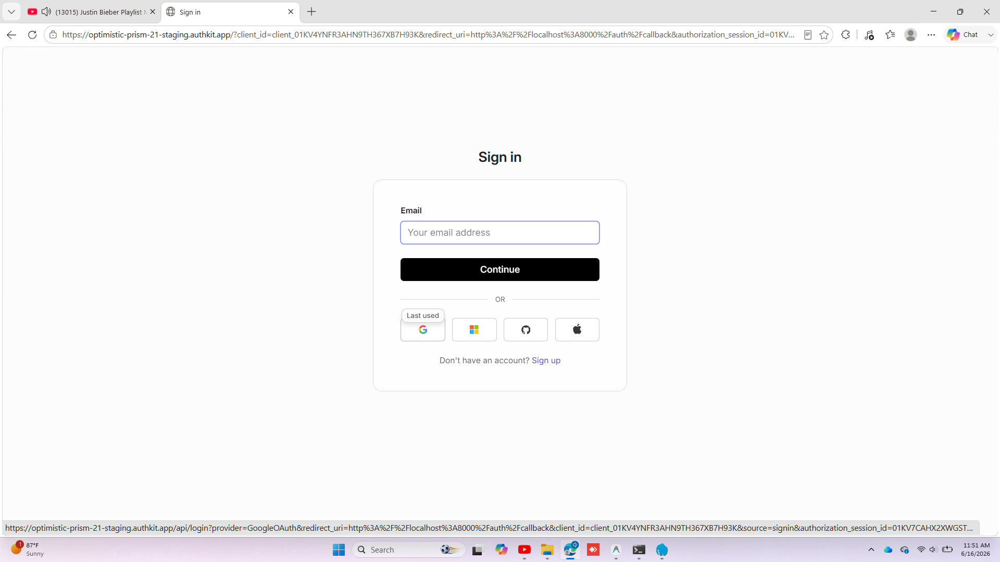
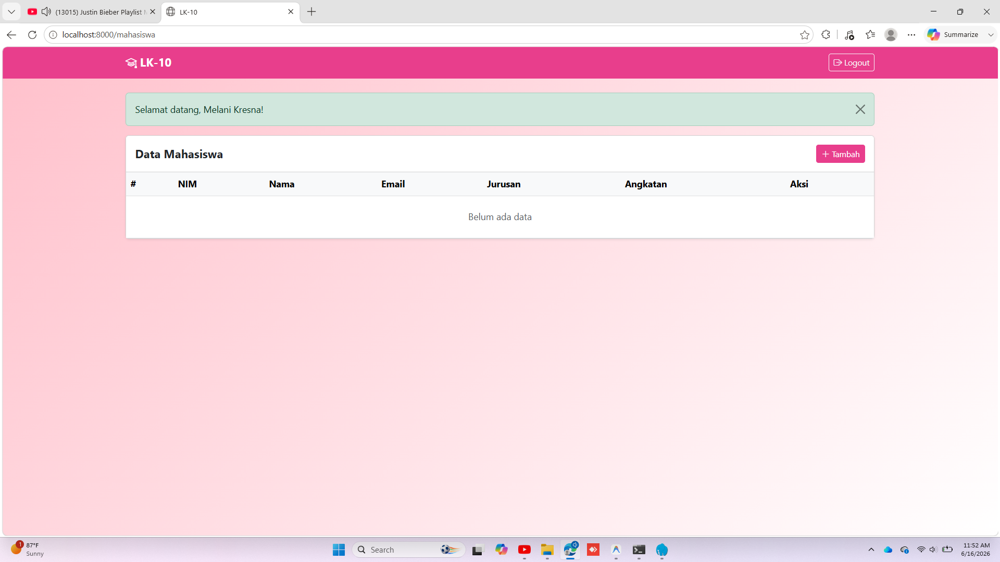
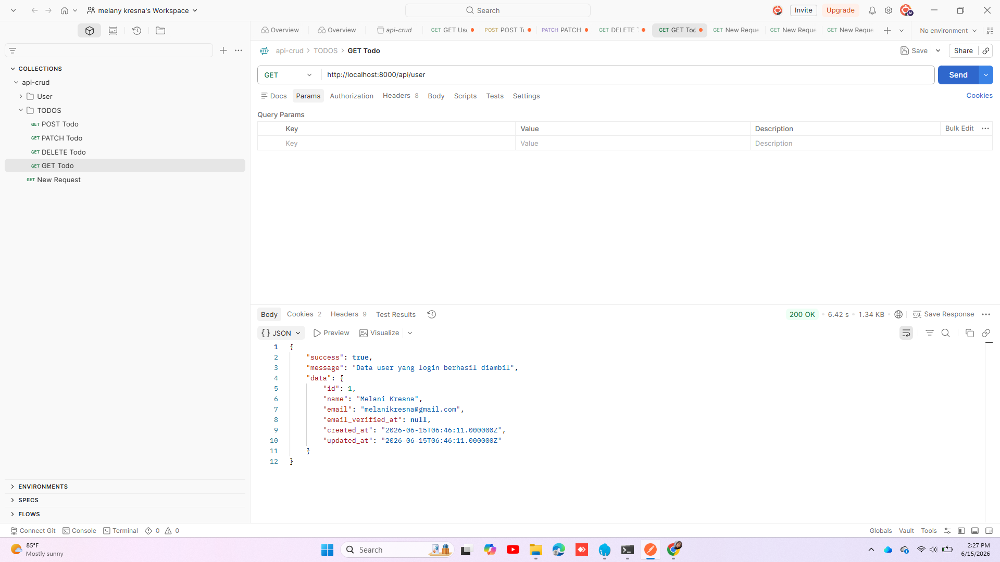

<<<<<<< HEAD

# Tampilan Halaman Utama

    

# LK-10
Nama: Melany Kresna Putri 
NIM: 24102015 
Mata Kuliah: Pemrograman Web 

## Preview Aplikasi

### Halaman Login Page

### Halaman Proteksi Login

### Halaman Pilih akun yang akan terhubung

### Halaman Tampilan Mahasiswa

### Halaman API User

=======
# LK-10
>>>>>>> 429718b68f83445ac59dce0272782ca0e5c72c8b
# LK-10
